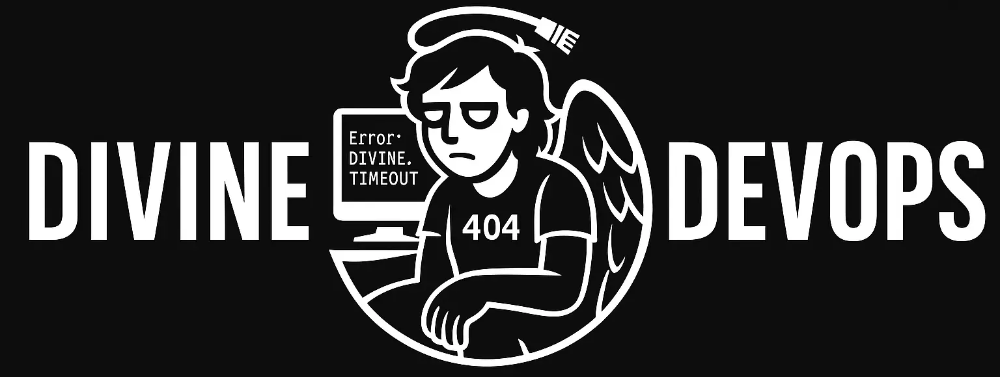

# Divine DevOps Universe

Welcome to the **Divine DevOps Universe** — a satirical blend of DevOps, biblical lore, and mythological mischief. Explore humorous posts, scripts, and creative content at the intersection of technology, religion, and modern software culture.

---

## 📖 Overview

This project parodies DevOps practices, workflows, and tools through the lens of ancient stories and modern tech. Each post mixes humor and technical insight, drawing inspiration from scripture, myth, and the realities of software development.

---

## 🗂️ Repository Structure

- **`_posts/`**: Published blog posts (Markdown with front matter)
- **`_future/`**: Drafts and upcoming posts
- **`_layouts/`**: Jekyll layout templates
- **`assets/`**: CSS, images, and static assets
  - **`css/`**: Site stylesheets
  - **`images/`**: Post and layout images
- **`scripts/`**: Python utilities for repo management

---

## ✨ Features

- Parody posts inspired by biblical and mythological themes
- Satirical takes on DevOps tools, workflows, and culture
- Automation scripts for managing content
- Responsive, mobile-friendly design

---

## 📚 Example Posts
- **Genesis x ChatGPT**: A humorous Q&A between God and ChatGPT about the creation of the earth.
- **Easter Regression Test**: A parody of resurrection workflows and CI/CD pipelines.
- **Wise Men Source Review**: A code review inspired by the Nativity story.

---

## 🏷️ Tags

- **DevOps:** devops, ci-cd, automation, logs, testing
- **Thematic:** parody, religion, mythology, nativity, resurrection
- **Technical:** source-code, api, docker, typescript, legacy
- **Collaboration:** slack, teamonsite, postmortem, documentation

---

## 📄 License

This project is a parody for entertainment purposes only. Not affiliated with any religious or technical organization.

---

## 🤝 Contributing

Contributions are welcome! Open a pull request or issue to suggest improvements or new content.

---

## 📧 Contact

Questions or feedback? Reach out to the Divine DevOps Team at divinedevopsuniverse@gmail.com.

---

Blessed by CI/CD. May your pipelines be ever green.